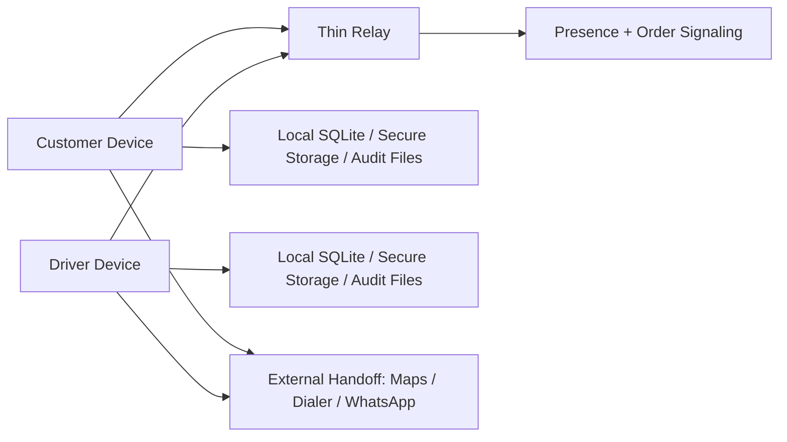
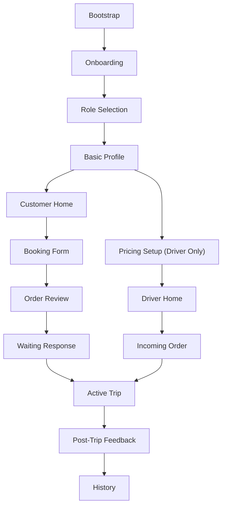

# CARRIER APP PROJECT

> **Just Fair**
>
> Adil untuk driver, customer, dan pengembang.

Carrier App Project adalah gagasan ride-hailing local-first yang mencoba mengambil jalan berbeda dari model platform konvensional: lebih ringan, lebih transparan, lebih ramah untuk mitra, dan lebih realistis untuk dibangun oleh tim kecil.

Repo ini saat ini berada di fase **planning + architecture hardening**. Source code React Native akan ditempatkan di root repo ini, sementara seluruh dokumen spesifikasi sudah dipusatkan di [`docs/`](./docs).

---

## Why This Project Matters

Kebanyakan sistem transportasi digital besar kuat di skala, tetapi sering:
- berat di sisi backend dan biaya operasional
- kurang fair untuk effort driver seperti pickup, waiting, dan mismatch
- terlalu sentralistik untuk eksperimen komunitas, freelance commute, atau model nebeng yang lebih fleksibel

Carrier mencoba membuka ruang baru:
- **semua user bisa jadi customer dan driver**
- **freelance commute-friendly**
- **local-first + thin relay**
- **fairness policy dibangun dari awal, bukan tempelan**

---

## Project Snapshot

| Area | Status |
|---|---|
| Product direction | locked |
| BRD / PRD / SDD / TSD | available |
| MVP scope lock | available |
| Sprint issue specs | available |
| React Native source | not started in this repo yet |
| Current phase | planning and execution preparation |

---

## About

Carrier App Project dirancang sebagai aplikasi transportasi dan nebeng modern yang:
- mendukung perjalanan harian, freelance ride, dan skenario komunitas
- menjaga data utama tetap berada di device user
- memakai relay tipis hanya untuk discovery dan signaling
- mendorong pengalaman yang hangat, sopan, dan tidak agresif

Model ini bukan mengejar “serverless absolut”, tapi mengejar sistem yang:
- lebih murah dibangun
- lebih ringan dioperasikan
- tetap masuk akal secara end-to-end

---

## Vision

Membangun platform mobilitas yang adil, ringan, dan manusiawi, tempat siapa pun bisa menjadi driver atau customer tanpa beban sistem platform yang terlalu besar.

## Mission

| Mission | Meaning |
|---|---|
| Fair to drivers | pickup, waiting, mismatch, dan effort driver dihargai |
| Fair to customers | harga transparan, state jelas, cancel/reason tidak manipulatif |
| Fair to builders | arsitektur tidak langsung menuntut backend mahal |
| Local-first by design | data inti tetap dekat dengan pemiliknya |
| Warm product experience | copy, tone, dan flow terasa menenangkan |

---

## Core Idea

Carrier bukan sekadar “aplikasi ojek lain”.

Ini adalah kombinasi dari:
- ride-hailing personal
- freelance commute support
- community ride coordination
- fairness-oriented pricing
- local-first architecture

---

## Product Positioning

| Dimension | Carrier |
|---|---|
| App model | single app, dual role |
| Storage model | local-first |
| Coordination model | thin relay |
| Driver model | freelance-friendly |
| Pricing mindset | transparent and explainable |
| Trust model | minimum-valid MVP, not fake certainty |
| UX tone | warm, humble, calm |

---

## Comparison

Tabel ini bukan klaim pasar atau benchmark resmi. Ini hanya menunjukkan **posisi desain produk** Carrier dibanding kategori brand yang sudah dikenal.

| Dimension | Carrier | Conventional ride-hailing brands (e.g. Gojek / Grab / Uber) |
|---|---|---|
| Source of truth data | dominan di device | dominan di backend platform |
| Backend posture | thin relay + local-first | server-heavy and centralized |
| Driver entry model | bisa mendukung freelance/occasional driver | umumnya lebih platform-controlled |
| Pickup fairness | explicit pickup surcharge policy | sering pickup effort terasa kurang terlihat |
| Waiting fairness | symmetric fairness | biasanya lebih berat ke salah satu sisi |
| Trust posture | minimum-valid MVP + audit + restriction ladder | biasanya stronger centralized verification |
| Build cost for early pilot | lower target | generally higher complexity |
| Product tone | community-warm and humble | often transactional at scale |

Catatan penting:
- Carrier **bukan** pengganti satu banding satu platform besar.
- Carrier mencoba unggul di **fairness, local-first design, dan cost discipline** untuk pilot awal.

---

## Architecture

### High-Level Model



### Architecture Principles

| Principle | Meaning |
|---|---|
| Local-first source of truth | profile, pricing, orders, history, audit ada di device |
| Thin coordination layer | relay hanya untuk presence dan order signaling |
| Audit by default | event penting wajib tercatat |
| Trust from day one | anti-abuse tidak ditunda ke phase 2 |
| Fairness built-in | pickup, waiting, mismatch, dan punishment dirancang eksplisit |

### Stack Direction

| Layer | Direction |
|---|---|
| Mobile app | React Native + TypeScript |
| Local persistence | SQLite |
| Secure secrets | Keychain / Keystore |
| Relay | Supabase Realtime |
| Push | Firebase FCM |
| Audit format | MessagePack + binary audit |

---

## MVP Wireflow



---

## What Makes This Interesting for Contributors

Contributors yang tertarik ke repo ini biasanya akan suka karena project ini menyentuh banyak area menarik sekaligus:

| Area | Why it is interesting |
|---|---|
| Product design | banyak tradeoff nyata antara fairness, cost, dan usability |
| Mobile architecture | local-first, recovery, offline state, secure storage |
| Realtime systems | thin relay, signaling, eventual recovery |
| Trust & safety | anti-abuse, mismatch, trust enforcement |
| UX writing | warm, non-judgmental, context-aware interaction |
| Monetization design | transaction log dan fairness economics |

---

## Contributor Opportunities

Kami belum masuk fase coding besar, jadi ini justru waktu yang bagus untuk ikut membentuk fondasinya.

Area kontribusi yang paling bernilai:
- React Native app foundation
- SQLite data layer and repository implementation
- navigation and wireflow implementation
- presence and realtime coordination
- booking and trip lifecycle
- audit/export system
- mobile design system
- copy and UX interaction

---

## Project Prospect

Kalau pilot ini berhasil, Carrier punya prospek yang kuat di beberapa jalur:

| Prospect | Why it matters |
|---|---|
| city-level pilot | validasi model fairness di pasar nyata |
| community / office commute | use case yang sering kurang terlayani platform besar |
| lightweight franchise / operator model | bisa tumbuh tanpa backend yang terlalu berat dari hari pertama |
| localized transport categories | motor, mobil, bajaj, angkot dengan model yang relevan per daerah |

Yang membuat prospek ini menarik bukan cuma “bisa jadi aplikasi transportasi”, tapi:
- bisa jadi **framework produk mobilitas yang lebih fair**
- bisa diuji dengan biaya lebih disiplin
- bisa dibangun bertahap dengan bukti, bukan asumsi

---

## Repository Layout

```text
.
├── README.md
├── docs/
│   ├── README.md
│   ├── trip-ojek-brd.md
│   ├── trip-ojek-prd.md
│   ├── trip-ojek-sdd.md
│   ├── trip-ojek-tsd.md
│   ├── trip-ojek-concept-diagram.md
│   ├── trip-ojek-research-report.md
│   ├── trip-ojek-sprint-1-issue-specs.md
│   ├── trip-ojek-sprint-2-issue-specs.md
│   ├── trip-ojek-sprint-3-issue-specs.md
│   └── trip-ojek-sprint-4-issue-specs.md
└── trip_full_user_flow_diagram.svg
```

---

## Start Reading Here

Kalau Anda baru masuk ke repo ini:

1. Baca [`docs/README.md`](./docs/README.md)
2. Lanjut ke [`docs/trip-ojek-prd.md`](./docs/trip-ojek-prd.md)
3. Setelah itu baca [`docs/trip-ojek-sdd.md`](./docs/trip-ojek-sdd.md) dan [`docs/trip-ojek-tsd.md`](./docs/trip-ojek-tsd.md)
4. Untuk eksekusi, masuk ke file issue spec sprint:
   - [`docs/trip-ojek-sprint-1-issue-specs.md`](./docs/trip-ojek-sprint-1-issue-specs.md)
   - [`docs/trip-ojek-sprint-2-issue-specs.md`](./docs/trip-ojek-sprint-2-issue-specs.md)
   - [`docs/trip-ojek-sprint-3-issue-specs.md`](./docs/trip-ojek-sprint-3-issue-specs.md)
   - [`docs/trip-ojek-sprint-4-issue-specs.md`](./docs/trip-ojek-sprint-4-issue-specs.md)

---

## Current Status

> Planning is not the product.
>
> But good planning is what makes a small team able to build the product without wasting months.

Carrier App Project sekarang sudah punya:
- BRD, PRD, SDD, dan TSD
- MVP scope lock
- architecture direction
- wireflow
- sprint issue specs
- engineering board

Yang belum ada di repo ini sekarang:
- source code React Native
- actual mobile modules
- production-ready infra implementation

---

## Join the Build

Kalau Anda tertarik ikut membangun:
- baca dokumen inti dulu
- ambil sprint issue specs yang sesuai
- jaga prinsip `Just Fair`
- jangan menambah kompleksitas phase 2 ke jalur pilot

Carrier masih di fase yang sangat menarik: cukup awal untuk dibentuk, cukup matang untuk mulai dieksekusi.
