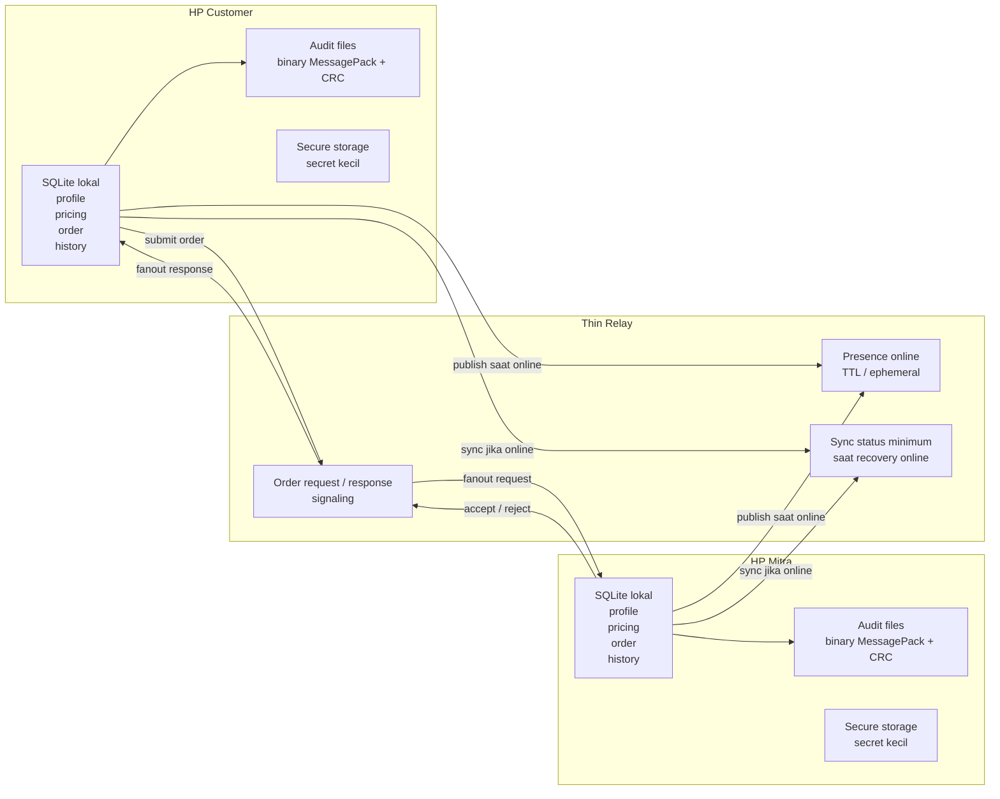

# Diagram Konsep Sederhana — Local Data vs Relay vs Binary Audit

Dokumen ini menjelaskan model mental paling sederhana untuk Carrier.

## 1. Prinsip Utama

1. **Data utama ada di device masing-masing**
   Profil, pricing, active order, history, dan transaction log disimpan di SQLite lokal.
2. **Relay bukan database utama**
   Relay hanya dipakai saat user online untuk presence dan order signaling yang sifatnya sementara.
3. **Binary audit bukan media komunikasi antar user**
   Binary audit dipakai untuk catatan lokal yang compact, tahan recovery, dan bisa diekspor saat diperlukan.

## 2. Diagram Besar

## 3. Data Mana Lokal

Disimpan lokal di HP user:

- `user_profile`
- `pricing_profile`
- `order_table`
- `transaction_log`
- `app_settings`
- index `audit_manifest`
- file audit binary per event

Artinya, kalau app ditutup lalu dibuka lagi, data inti tetap dibaca dari storage lokal, bukan ditarik ulang dari server.

## 4. Data Mana Relay

Data yang lewat relay hanya yang dibutuhkan untuk koordinasi online:

- status online/offline
- lokasi sekarang untuk discovery yang sedang aktif
- order request
- order response
- sync status minimum saat recovery

Data ini **bukan histori permanen utama**. Ia hanya membantu dua device bertemu saat sama-sama online.

## 5. Kapan Binary Audit Dipakai

Binary audit dipakai saat ada event bisnis penting, misalnya:

- app selesai bootstrap
- user online/offline
- pricing berubah
- order dibuat, diterima, ditolak, dibatalkan, selesai
- handoff ke Maps, Dialer, WhatsApp
- transaction log tercatat

Alurnya:

1. Event bisnis terjadi.
2. App membentuk payload compact.
3. Payload di-encode ke MessagePack.
4. App menulis file binary audit ke storage lokal.
5. Manifest event di-index di SQLite.
6. Jika dibutuhkan, event-event ini bisa diexport menjadi bundle `.carrieraudit`.

## 6. Yang Perlu Diluruskan

### Bukan seperti ini

- data log ditanam ke binary aplikasi
- binary audit dipakai sebagai kanal komunikasi antar user
- seluruh sistem berjalan multi-user hanya dengan local storage tanpa relay

### Yang benar untuk Carrier

- binary aplikasi hanya berisi kode app
- data runtime ditulis ke SQLite, file system, dan secure storage
- binary audit adalah format penyimpanan lokal yang ringkas
- komunikasi antar user saat online tetap butuh relay

## 7. Jawaban Singkat atas Kebingungan Utama

**Apakah sistem bisa decentralised hanya dengan local storage HP?**

Tidak penuh. Ia bisa **local-first**, tetapi untuk discovery dan komunikasi antar user yang sedang online tetap perlu relay.

**Apakah binary audit membuat size lebih ringan?**

Ya, untuk audit trail lokal. Tetapi ini tidak menggantikan SQLite, dan tidak menggantikan relay.

**Apakah konsep ini mengurangi cost server?**

Ya. Karena server tidak menjadi source of truth utama dan tidak menyimpan histori besar. Tetapi cost server tidak nol, hanya jauh lebih kecil dibanding backend konvensional yang menyimpan semua state bisnis.

